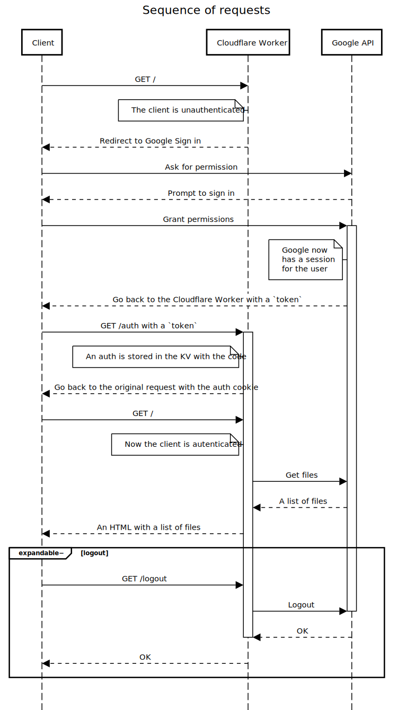

# ( ◕◡◕)っ Cloudflare Workers Google OAuth

This is a companion repository for the blogpost at [Apimhub :: Tech blog](https://apiumhub.com/tech-blog-barcelona/).

## One picture summary


<details>
  <summary>Generated with <a href="https://sequencediagram.org/" target="_blank" rel="noopener noreferrer">sequencediagram.org</a></summary>
    ```
    title Sequence of requests

    Client->Cloudflare Worker: GET /
    note left of Cloudflare Worker: The client is unauthenticated
    Cloudflare Worker-->Client: Redirect to Google Sign in
    Client->Google API: Ask for permission
    Google API-->Client: Prompt to sign in
    Client->Google API: Grant permissions
    activate Google API
    note left of Google API: Google now\nhas a session\nfor the user
    Google API-->Client: Go back to the Cloudflare Worker with a `token`
    Client->Cloudflare Worker: GET /auth with a `token`
    activate Cloudflare Worker
    note left of Cloudflare Worker: An auth is stored in the KV with the code
    Cloudflare Worker-->Client: Go back to the original request with the auth cookie
    Client->Cloudflare Worker: GET /
    note left of Cloudflare Worker: Now the client is autenticated
    Cloudflare Worker->Google API: Get files
    Google API-->Cloudflare Worker: A list of files
    Cloudflare Worker-->Client: An HTML with a list of files
    expandable− logout
    Client->Cloudflare Worker: GET /logout
    Cloudflare Worker->Google API: Logout
    deactivate Google API
    Google API-->Cloudflare Worker: OK
    deactivate Cloudflare Worker
    Cloudflare Worker-->Client: OK
    end
    ```
</details>

A more detail explanation of how Google Sign in should behave can be found in Google's docs: [Using OAuth 2.0 for Web Server Applications](https://developers.google.com/identity/protocols/oauth2/web-server).

## Requirements

- [wrangler](https://developers.cloudflare.com/workers/cli-wrangler/install-update) 1.17 or newer.
- A [Cloudflare account](https://dash.cloudflare.com).
- A Google Services account
  - With the API you wish to consume enabled. e.g: https://console.developers.google.com/apis/api/drive.googleapis.com/overview
  - A Google OAuth Client ID and Secret, from the [Credentials](https://console.cloud.google.com/apis/credentials) > + Create credentials > Oauh client ID. _Note: "Authorized redirect URIs" should have your cloudflare worker url with `/auth` at the end, and optionaly `http://127.0.0.1:8787/auth` to work locally.

### Setup wrangler

1. Clone this template: `wrangler generate [a name] https://github.com/apiumhub/cloudflare-sorkers-google-oauth`.
1. Update the worker's secrets with the ones generated 👆:
   - `wrangler secret put CLIENT_ID [your client id]`
   - `wrangler secret put CLIENT_SECRET [your client secret]`
1. Create a `KV` namespace: `wrangler kv:namespace create "authTokens"` and update the `wrangler.toml` accordingly.

## Ideas to grow this projecta
If you woudl like to use this setups as a starting point to develop interesting things; I recomend trying out one (or all!) of this imrovements:

- Create a middleware pattern to deaal with authenticated and unauthenticated endpoints
- Serve static content, either with Cloudflare Sites, or reading local files in a Worker. A default path could be implemented to serve files in `public/` folder.
- Improve the rendered HTML with a template library, or roll up your own!


## Glosary
Thoughout this project there are two somewhat similar, but distincts concepts:
 - `token`: Is the authentication method for Google
 - `auth`: Is the authentication method for this Worker.

The app deals with both, in very different ways; and it is the `KV` that provides a one way transformation between `auth` to `token`.
 
## Developing
Once the requirements are fullfiled, simply run `npm run dev`.

## Testing
Rn `npm test` for jest tests.

#### ⚠️ Caveats

Some 🪄 wizardry was implemented to know if the code was running locally (with `wrangler dev`) or in the cloud; as `wrangler dev` reweites the `request.url` to always match the environment.