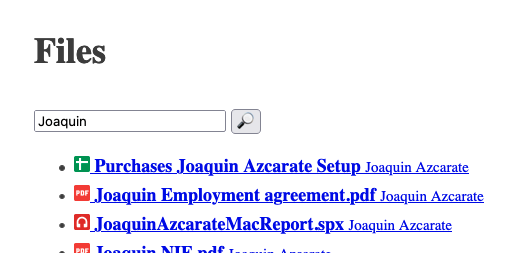

_The original can be found at [Apiumhub :: Tech blog](https://apiumhub.com/tech-blog-barcelona/implementing-google-oauth-google-api-cloudflare-workers/)._

# Implementing Google OAuth to use Google API in Cloudflare Workers
Recently I had the opportunity to build a small application that needed to authenticate and authorize a user using Google's sign-in mechanism, and requests on their behalf data from a Google API.

I choose to implement this as a Cloudflare Worker as a [serverless compute service](https://www.cloudflare.com/learning/serverless/what-is-serverless/) leveraging [Cloudflare key-value storage (KV)](https://developers.cloudflare.com/workers/learning/how-kv-works) for session storage. The tooling from Cloudflare ([`wrangler`](https://developers.cloudflare.com/workers/cli-wrangler)) has evolved nicely since my first attempt at Cloudflare Workers, so I thought it was a high time that I gave it another try.

As any good software engineer would, I started searching for any repository I could use a template to wire up Google OAuth easily.
But I failed to find anything that would play nicely with Cloudflare Web worker, or had some proper documentation/tests, or had a decent quality to it. So in this blog post (and in the companion GitHub repository [jazcarate/cloudflare-worker-google-oauth](https://github.com/jazcarate/cloudflare-worker-google-oauth)), I want to document, explain and go over some interesting decisions so someone just like me would have this to springboard their development.

That being said, feel free to _yoink_ any or all of the code from the [repo](https://github.com/jazcarate/cloudflare-worker-google-oauth).

## Result
First of all, this is what we'll develop: An app that can display and filter a user's Drive files; and provide a link to them.



I choose Google's Drive listing API as an excuse. Everything we'll see from now on can be easily changed to use any of the [myriad of Google APIs](https://developers.google.com/workspace/products), as they all require roughly the same authentication and setup.

## Structure and Systems
To decouple the logic from external sources *such as Google), the project is best understood as a slim entry point `index.ts`, the core business logic in the handling method (`handler.ts`), and every external dependency in the `lib/` folder.

The main interface from `handler.ts` is a function that [injects](https://en.wikipedia.org/wiki/Dependency_injection) all the systems
```ts
export default function (
  kv: KVSystem,
  google: GoogleSystem,
  env: EnvSystem,
  crypto: CryptoSystem,
): (event: FetchEvent) => Promise<Response> {
  const { remove, get, save } = kv
  const { tokenExchange, removeToken, listDriveFiles } = google
  const { isLocal, now } = env
  const { generateAuth } = crypto
  //...

```

This not only helps separate concerns but allows us to mock external dependencies in the tests.

### Initial request
Once we have all systems initialized, we do match if the request is an `/auth` callback. We'll come back to this section later.
If the request is not a callback, then I check if the user is authenticated. There are several ways in which a user might not be.

Like if they don't present any cookies.
```ts
const cookies = request.headers.get('Cookie')
if (!cookies) return login(env, google, url)
```

Or if they have cookies, but not the one we care (`auth`)
```ts
const auth = findCookie(AUTH_COOKIE, cookies)
if (!auth) return login(env, google, url)
```

Or the KV does not have an entry for that auth cookie (either because it has expired, or that the client is malicious and trying to guess)
```ts
const token = await get(auth)
if (!token) return login(env, google, url)
```

### Authenticated
After this point, I know that the user is authenticated. This means I have access to their `token` to query Google API.

So now I need to choose one of three paths:
1. If it is to the root (`/`)
1. If the request is to `/logout`
1. or any other path.

Of note, this is just the `pathname`, it does not include search params like `?q=foo`; so the URL `/?q=foo` `.pathname` is just `'/'`

```ts
switch (url.pathname) {
    case '/':       // ...
    case '/logout': // ...
    default:        // ...
}
```

#### List files
If the request is to the root, then I query Google API with the `Authorization` token like the [API](https://developers.google.com/drive/api/v2/search-files) expects
```ts
async function listDriveFiles(
  accessToken: string,
  query: string | null,
): Promise<DriveFiles> {
  const url = new URL('https://www.googleapis.com/drive/v2/files')
  if (query) url.searchParams.append('q', `title contains '${query}'`)

  const response = await fetch(url.toString(), {
    headers: { Authorization: `Bearer ${accessToken}` },
  })
  /// ...
}
```

If the `fetch` returns something, I check the body for errors and panic if needed
```ts
const resp = await response.json()
if (resp.error) throw new Error(JSON.stringify(resp.error))
```

Once Google answers a list of files, then it is just a matter of rendering them. I decided to keep the rendering simple, and inline the whole HTML; but this can be easily adapted to return a JSON, or use a proper template engine. I'll leave this as an exercise for the reader.


#### Logout
In the logout case, we revoke the token with google, we remove the auth from the KV and we reply to the client with a deleted cookie.

```ts
event.waitUntil(Promise.allSettled([removeToken(token), remove(auth)]))
        
return new Response('Loged out', {
    headers: setCookie('deleted', EXPIRED),
})
```
I leverage the [`waitUntil`](https://developers.cloudflare.com/workers/learning/fetch-event-lifecycle#waituntil) lifecycle to respond to the client immediately, and call google and remove the KV in the background. And I use `allSettled` as I don't particularly care if the KV couldn't be deleted, or if Google had trouble removing the token as there is not much more I would be able to do.

#### Not found
Otherwise, I simply return a status `404 Not Found`.
```ts
return new Response('Not found', { status: 404 })
```

### Callback
Going back to the `/auth` request; this needs no authentication (as we are in the process of creating it). So I just check for the contract that [Google sign-in documents](https://developers.google.com/identity/protocols/oauth2/web-server#sample-oauth-2.0-server-response). 
The query params has no errors
```ts
const error = url.searchParams.get('error')
if (error !== null)
    return new Response(`Google OAuth error: [${error}]`, { status: 400 })
```

And it has a `code`
```ts
const code = url.searchParams.get('code')
if (code === null)
    return new Response(`Bad auth callback (no 'code')`, { status: 400 })
```

If so, we can exchange the code for a proper `token` via another Google API
```ts
const response = await fetch('https://oauth2.googleapis.com/token', {
    method: 'POST',
    headers: {
        'Content-Type': 'application/x-www-form-urlencoded',
    },
    body,
})
```

and again check for errors
```ts
const resp = await response.json()
if (resp.error) throw new Error(resp.error)
```

With a valid Google `access_token` in hand, we generate a random string for the application's authentication
```ts
const newAuth = generateAuth()
```

And store in the KV the way to translate from `newAuth` to `access_token`
```ts
await save(
    newAuth,
    tokenResponse.access_token,
    //...
)
```

Finally, we send the client back to wherever they came from, with their new authentication cookie.
_We stored the original URL in the `state` param that Google OAuth allows us to send._
```ts
return redirect(
    '/' + decodeURIComponent(url.searchParams.get('state') || ''),
    setCookie(newAuth, new Date(expiration)),
)
```

## Other systems
The systems in the `lib/` folder are quite straightforward, and can be divided into two subgroups conceptually:

### Cloudflare enhanced dependencies

As this application is running in Cloudflare Workers (both the real environment in the cloud and the dev environment generated by `npm run dev`), some variables are injected into the global scope. These variables are typed in the `bindings.d.ts` file; and are generated by steps 2 and 3 from [README.md#Setup wrangler](https://github.com/jazcarate/cloudflare-worker-google-oauth#setup-wrangler).

- **KV** module uses the global `authTokens` variable that Cloudflare Worker injects into the worker. More information about how KV work can be found [here](https://developers.cloudflare.com/workers/learning/how-kv-works).
- **Env** module keeps the environment injectable. Even though we could use the global variables _(`CLIENT_ID` and `CLIENT_SECRET`)_ injected to the web worker, this approach allows me to test the `handler` without having to re-wire global variables; that is a pain.

### Utils
And some other systems that are not Cloudflare Worker dependant, but more like utility functions, grouped by their specific domain.

- **http** module has some utils to parse the Cookies header format and build a `302 Redirect` response.
- **Google** module has a types API using just `fetch`.
- **Crypto** module is a small utility to use the `crypto` API to generate a secure-random string.
